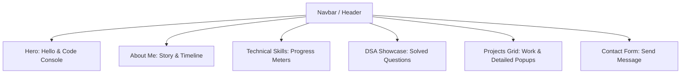
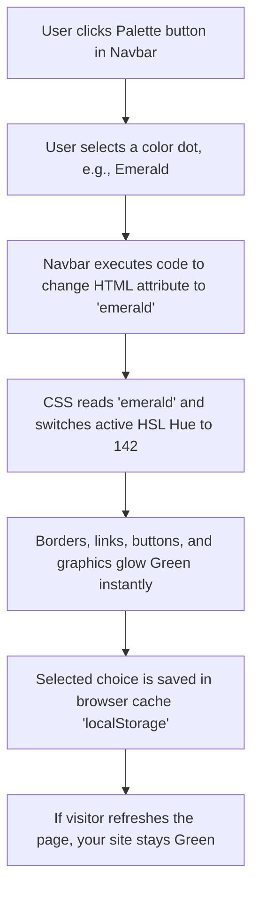
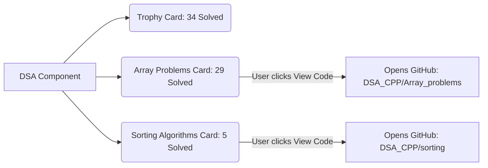
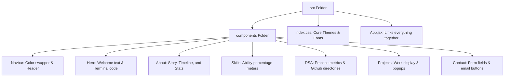
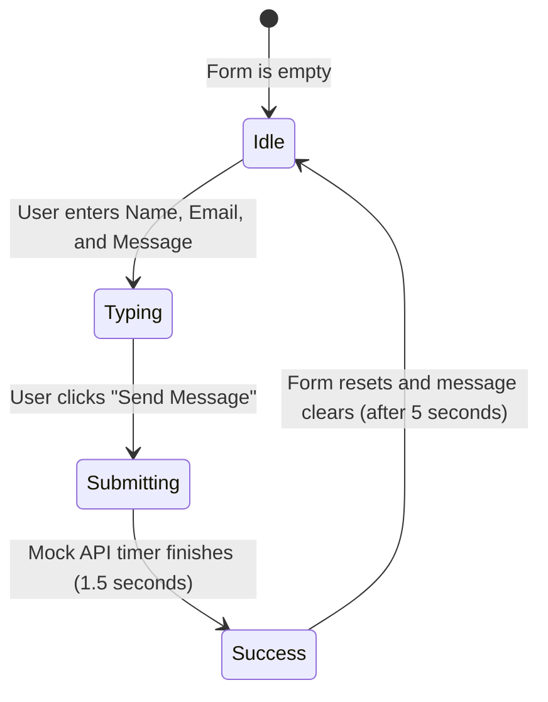

# Simple Portfolio Guide: How Your Website Works

This guide explains your portfolio website in plain, simple language using diagrams and flowcharts.

---

## 🗺️ 1. Main Website Sections (The Layout)
Think of your website as a single page divided into 7 blocks. When visitors click a link in the Navbar, it scrolls them smoothly to that section.

---

## 🎨 2. How the Accent Color Switcher Works
Your website has a unique feature: visitors can change the highlight colors (Violet, Emerald, Cyan, or Amber). Here is how that color-switching magic happens:

---

## 🏆 3. How Your DSA Questions Showcase Works
This section pulls data from your GitHub repository `DSA_CPP` and shows your problem-solving progress.

---

## 📁 4. The Project File Directory (Brief Explanation)
Here is a simple map of where files are located and what they do:

---

## ✉️ 5. How the Contact Form Works
When a visitor wants to send you a message, the contact form goes through these steps:

---

## 💻 6. Simple Tech Glossary (Bite-sized Definitions)

Here is a quick lookup of the technologies used to build your website, written in plain language:

| Technology | What it is | Role on Your Website |
| :--- | :--- | :--- |
| **HTML5** | **The skeleton** (HyperText Markup Language) | Defines the structure: tells the browser where your text, image boxes, and inputs go on the page. |
| **CSS3** | **The clothes & style** (Cascading Style Sheets) | Sets the looks: colors, glowing borders, font sizing, margins, and the blurred glass backdrop cards. |
| **JavaScript (ES6+)** | **The muscles & brain** | Makes things move: controls menu clicks, monitors page scroll positions, and changes active links. |
| **React** | **The building block kit** (JS Library) | Instead of building one giant page, React lets us build small, reusable blocks (called *Components*) like Navbar, Hero, or Projects. |
| **Node.js** | **The local engine** | Lets us run compilation tools (like Vite) and install icon helper packages directly on your PC. |
| **Vite** | **The quick delivery guy** (Build Tool) | Bundles your JavaScript and CSS into small, clean packages so the website loads instantly in the browser. |
